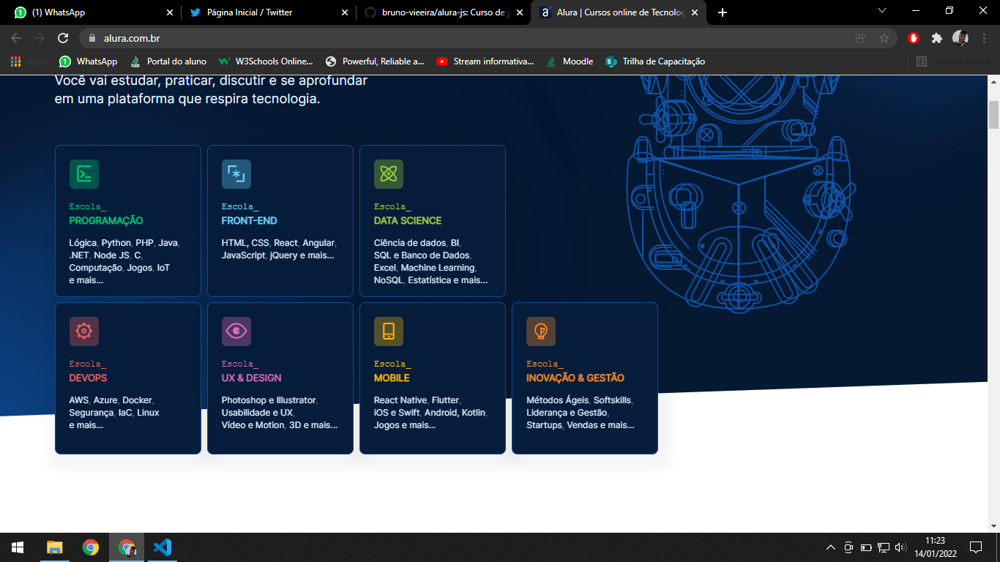

# Fundamentos Javascript: Cursos Alura

 
- Tipos, variáveis e funções
- ⏲️ Carga horária: 12h
### Objetivos do curso:
- Aprenda uma linguagem de programação desde seus blocos básicos ✔️
- Entenda as particularidades do JavaScript e como trabalhamos com elas ✔️
- Descubra as diferentes formas de usar funções e variáveis no JS, e seus usos ✔️
- Saiba quais são os tipos de dados aceitos no JS e quando utilizar cada um ✔️
- Pratique com os conceitos básicos e adquira conhecimentos sólidos ✔️

[Link do curso](https://cursos.alura.com.br/course/fundamentos-javascript-tipos-variaveis-funcoes)

# Fundamentos do Javascript: Arrays

- Arrays
- ⏲️ Carga horária: 10h
### Objetivos do curso:
- Aprender o que são arrays e porque são importantes ✔️
- Aprender a como alterar arrays com os métodos do JS ✔️
- Entender o que são laços de repetição e como usá-los ✔️
- Aprender a modificar arrays utilizando métodos do JS moderno (ES6 em diante) ✔️
- Praticar com os conceitos básicos e adquira conhecimentos sólidos ✔️
  
[Link do curso](https://cursos.alura.com.br/course/fundamentos-javascript-arrays)

# Fundamentos do Javascript: Objetos

- Objetos
- ⏲️ Carga horária: 10h
### Objetivos do curso:
- Aprender o que são objetos e por que são importantes ✔️
- Ver como acessar dados em um objeto, alterar e adicionar com métodos do JS ✔️
- Entender o que são propriedades e métodos de um objeto ✔️
- Criar objetos a partir de funções construtoras ✔️
- Entender o conceito de protótipos em JavaScript ✔️
- Aprenda os conceitos básicos de Orientação a Objetos com JavaScript ✔️
 
[Link do curso](https://cursos.alura.com.br/course/fundamentos-javascript-objetos)
